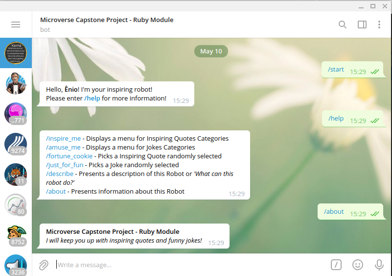
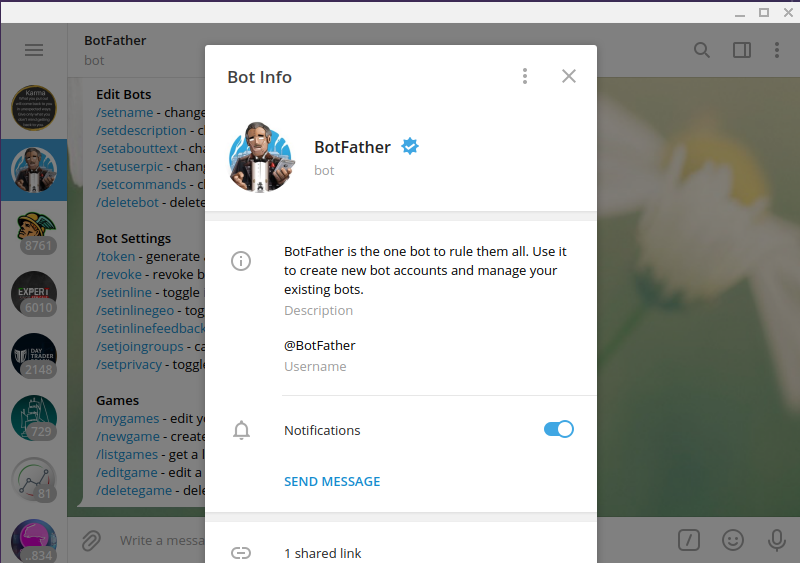

# Telegram Robot with Ruby!

> Microverse Capstone Project - Ruby Module

## What can this bot do?

**I will keep you up with inspiring quotes and funny jokes!**

> Inspirational quotes are one way to help stay positive, productive, and happy as you move along your journey. Even saying one daily motivational quote in the mirror each more can make a huge impact on your day-to-day life.
> Additionally, keep in mind that old saying: "Laughter is the Best Medicine". Laughter strengthens your immune system, boosts mood, diminishes pain, and protects you from the damaging effects of stress. So, let's keep our mood up!

## Built With

- Ruby (version 3.0.1)
- The following required Gems:
  - gem 'nokogiri' (version 1.11.3)
  - gem 'rspec' (version 3.10.0)
  - gem 'rubocop' (version 1.14.0)
  - gem 'telegram-bot-ruby' (version 0.15.0)

## Live Demo

To avoid the disclosure of the API Token used in this project, no live demo was provided. _Please, follow the steps listed below to run this app on your machine_.

## Getting Started

To get a local copy up and running, follow these simple example steps:

### Prerequisites

- You should have Ruby (version 3.0.1 or higher) installed on your computer.
- You should also have an account on Telegram and you should also create a new robot on the platform, as showed bellow:

### Create your Telegram Robot

To run this project, you'll need to create your rob

- On Telegram, search for [@BotFather](https://t.me/BotFather), this is an app provided by Telegram for creating bots
  
- Once you've started BotFather, enter `/newbot`
- Then, enter your bot name and a username. Notice that the bot's username should be finished with `bot`
- Now you should recieve an API Token. Save this information for later use.
- Finally, search for your newly created robot on Telegram and start it!

### Install

- On your bash, go to the directory of your preference and run `git clone git@github.com:enionsouza/Telegram-Bot.git`
- Next run `cd Telegram-Bot/config`
- Open the file named `robot_token-example.txt` with the editor of your preference.
- Now, replace the provided example of API Token with the token that you've receirved from BotFather, in the previous step. Save this edited file in this same directory with the name `robot_token.txt`
- Next, on your bash, run `cd ..`
- Finally, to run the required gems used in this project run `bundle install`

### Run tests

- To run the tests, go to your `Telegram-Bot` directory, and run `rspec`

### Usage and Deployment

- Now that you're in `Telegram-Bot` directory, run `cd bin`
- To turn your Telegram Robot on, either run `./main.rb` or `ruby main.rb`
- Now go to your Telegram Robot and enter `/help`. The other available commands should appear on your screen, as the robot's response

### About the quotes and jokes sources

- For this project, the quotes and jokes were web scraped from the following pages:
  - [Get Inspired: 200+ Motivational Quotes To Encourage Your Success](https://www.shopify.com/blog/motivational-quotes)
  - [145 Best Dad Jokes That Will Have the Whole Family Laughing](https://www.countryliving.com/life/a27452412/best-dad-jokes/)
  - [50 Funny Short Jokes That Guarantee a Laugh](https://bestlifeonline.com/funny-short-jokes/)
  - [75 Short Jokes Anyone Can Remember](https://www.readersdigest.ca/culture/10-short-jokes-anyone-can-remember/)
- The web scraping was automatically performed and, _for testing purposes_, you can also delete the directory named `src` along with all its content files. When `./main.rb` is run in the `bin` directory, new source files will be regenerated from the mentioned sources. You can also re-run the RSpec tests, for sanity check of the newly generated source files.

## Author

👤 **Ênio Neves de Souza**

- GitHub: [@enionsouza](https://github.com/enionsouza)
- Twitter: [@enionsouza](https://twitter.com/enionsouza)
- LinkedIn: [LinkedIn](https://www.linkedin.com/in/enio-neves-de-souza/)

## 🤝 Contributing

Contributions, issues, and feature requests are welcome!

Feel free to check the [issues page](https://github.com/enionsouza/Telegram-Bot/issues).

## Show your support

Give a ⭐️ if you like this project!

## Acknowledgments

- My beloved family, for all the support provided!
- [@fernandorpm](https://github.com/fernandorpm), for the valuable tips! Thanks, my mentor!
- Microverse Support Team

## 📝 License

This project is [MIT](./LICENSE) licensed.
